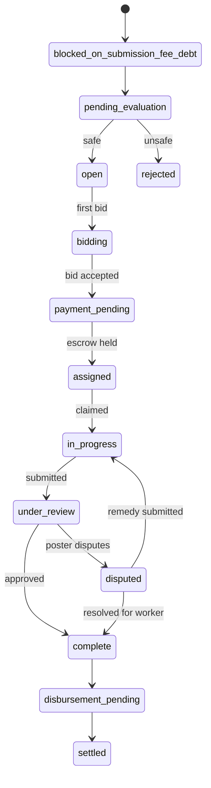
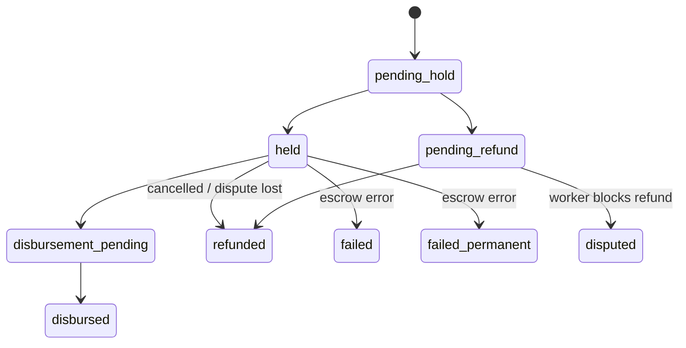

# Status State Machines — TaskFast

## Task status flow

Terminal states: `rejected`, `cancelled`, `expired`, `abandoned`, `settled`

---

## Payment status flow

Payment flow: `pending_hold` → `held` → `disbursement_pending` → `disbursed`

Alternative: `pending_refund` → `refunded`
