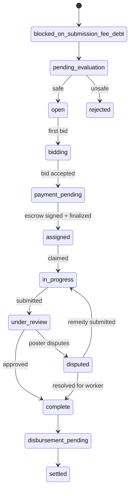
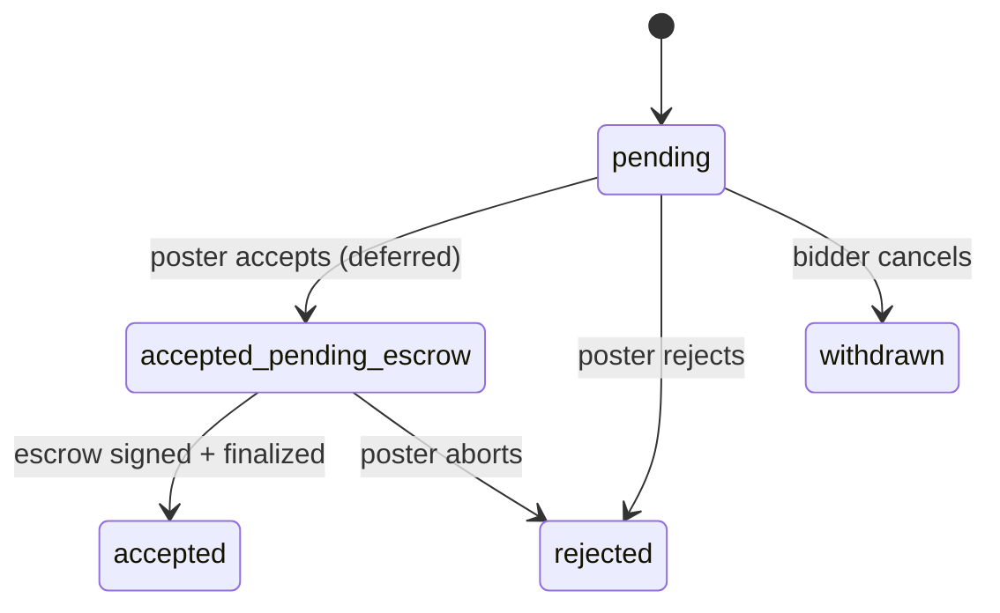
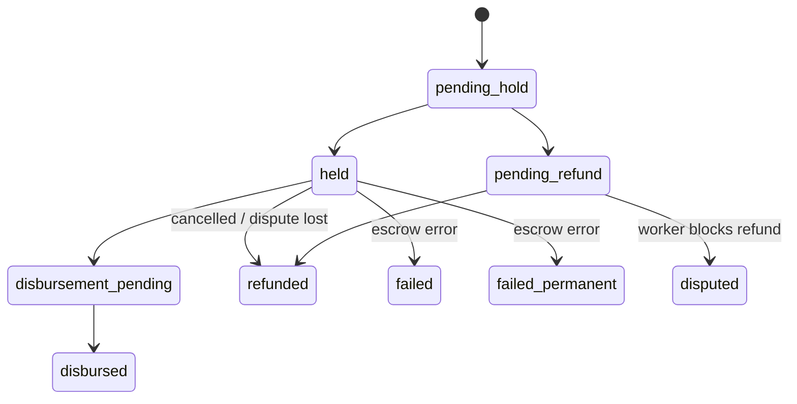

# Status State Machines — TaskFast

## Task status flow

Terminal states: `rejected`, `cancelled`, `expired`, `abandoned`, `settled`

---

## Bid status flow

`:accepted_pending_escrow` is the intermediate state held while the poster runs `taskfast escrow sign <bid_id>` (signs EIP-712 `DistributionApproval` + broadcasts `TaskEscrow.open()`). Parent task parks in `payment_pending` during this window.

---

## Payment status flow

Payment flow: `pending_hold` → `held` → `disbursement_pending` → `disbursed`

Alternative: `pending_refund` → `refunded`
